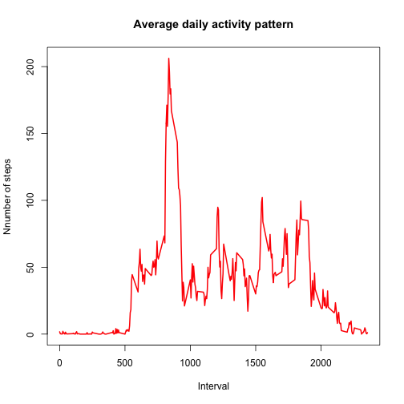
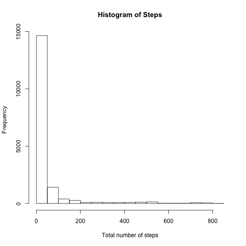
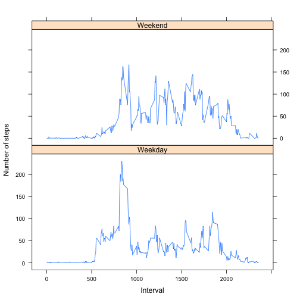

## Part 1
### Load the data.

```r
df <- read.csv("activity.csv")
```


### Caculate the total number of steps taken per day.

```r
library(dplyr)
```

```
## 
## Attaching package: 'dplyr'
## 
## The following object is masked from 'package:stats':
## 
##     filter
## 
## The following objects are masked from 'package:base':
## 
##     intersect, setdiff, setequal, union
```

```r
df.tnspd <- df %>% group_by(date) %>% summarise(tnspd=sum(steps))
```
> ##### *NOTE: tnspd = total numner of steps taken per day*


### Mean and Median of the total number of steps taken per day
##### Numbers are rounded and scientific notation was suppressed.

```r
mean.tnspd <- mean(df.tnspd$tnspd, na.rm=TRUE)
mean.tnspd
```

```
## [1] 10766.19
```
> **The mean of the total number of steps taken per day: 10766**


```r
med.tnspd <- median(df.tnspd$tnspd, na.rm=TRUE)
med.tnspd
```

```
## [1] 10765
```
> **The median of the total number of steps taken per day: 10765**


### The average daily activity pattern
##### *Raw data (df) was grouped by 'interval', then the number of steps was averaged across all days (nsaad) for each interval. The resulting data frame was named as 'df.5min.int'.* 

```r
df.5min.int <- df %>% group_by(interval) %>% summarise(nsaad=mean(steps, na.rm=TRUE))
plot(nsaad~interval, 
     data=df.5min.int, 
     type='l',
     xlab="Interval",
     ylab="Nnumber of steps",
     main="Average daily activity pattern",
     col="red",
     lwd=2)
```

 


### Time interval containing the maximum value for the number of steps averaged across all days

```r
int.max.nsaad <- df.5min.int %>% filter(nsaad==max(nsaad))
```
> **The time intreval id containing nsaad: 835**


## Part 2: Imputing missing values
### Total number of missing values in the dataset

```r
df.na <- df %>% filter(is.na(steps))
length(df.na[,1])
```

```
## [1] 2304
```
> **Total number of NAs: 2304**


### Replacing NA with the mean for that 5-minute interval
##### Check 'steps' varilable using a for loop, and if NA is found for a 5-minute interval, fill it with the mean for that 5-minute inverval. The means for 5-minute intervals are calculated in "The average daily activity pattern" with resulting data frame 'df.5min.int'.

```r
# Generate a new data set (df.new) from the original data set (df)
df.new <- df
# Fill any NA with the mean for that 5-minute interval stored in 'df.5min.int'.
for (i in 1:length(df.new[,1])) {
        if (is.na(df.new[i,1])==TRUE) {
                df.new[i,1] = df.5min.int[df.5min.int[,1]==df.new[i,3],2]
        }
}
```


### Histogram of the total number of steps takne each day
##### Data set 'df.non.na' was used, i.e., there is not any NA in the data set.

```r
hist(df.new$steps,
     xlab="Total number of steps",
     main="Histogram of Steps")
```

 


### Means and Median total number of steps taken per day
##### First, Variables in the new data set, in which NAs are imputed, are grouped by date. Then mean and median are calculated as in Part 1. Results are rounded and scientific notation is supporessed. 

```r
df.new.tnspd <- df.new %>% group_by(date) %>% summarise(tnspd=sum(steps))
mean.tnspd.new <- mean(df.new.tnspd$tnspd)
med.tnspd.new <- median(df.new.tnspd$tnspd)
```
> *Mean from data set with NAs: 10766*

> *Mean from data set with NA imputed: 10766*

> *Median from data set with NAs: 10765*

> *Median from data set with NA imputed: 10766*

##### **Almost no differecne before and after imputing NAs in the data set is observed. Therefore, there is not any siginficant impact from imputing missing values in the data set.** 


## Part 3: Weekdays vs Weekends
### Creating a new factor variavle with two levels - "weekday" and "weekend"
##### Firstly, create variable 'day' which is converted from 'date' in the data set (df.new). Then, using a for loop and if statment, convert the 'day' variable indicating "weekday" and "weekend". 

```r
# Creating a variable 'day'
df.new.day <- df.new %>% mutate(day=weekdays(as.POSIXlt(date)))
# Creating a factor variable 'type' 
for (i in 1:length(df.new.day[,1])) {
        if (df.new.day[i,4]=="Saturday") {
                df.new.day[i,4]="Weekend"
        } else if (df.new.day[i,4]=="Sunday") {
                df.new.day[i,4]="Weekend"
        } else {
                df.new.day[i,4]="Weekday"
        }
}
```


### A panel plot: Comparison of activity patterns between 'weekday' and 'weekend' 
##### Firstly, separate data points into two groups, i.e., 'weekday' and 'weekend'

```r
df.weekday <- df.new.day %>% filter(day=="Weekday")
df.weekend <- df.new.day %>% filter(day=="Weekend")
```


##### Secondly, similar to Part 1, create averaged daily activity patterns for 'weekday' and 'weekend'. Then, combine the two data. 

```r
df.5min.int.weekday <- df.weekday %>% group_by(interval) %>% summarise(nsaad=mean(steps))
df.5min.int.weekend <- df.weekend %>% group_by(interval) %>% summarise(nsaad=mean(steps))
df.5min.int.new <- bind_rows(df.5min.int.weekday, df.5min.int.weekend)
# Add factor variable indicating 'weekday' and 'weekend' to the newly combined data.
day <- rep(c("Weekday", "Weekend"), each=length(df.5min.int$interval))
df.5min.int.new.day <- data.frame(df.5min.int.new, day=as.factor(day))
```


##### Finally, Draw a panel plot 

```r
library(lattice)
xyplot(nsaad~interval|day, data=df.5min.int.new.day, layout=c(1,2),
       xlab = "Interval",
       ylab = "Number of steps",
       type="l")
```

 

